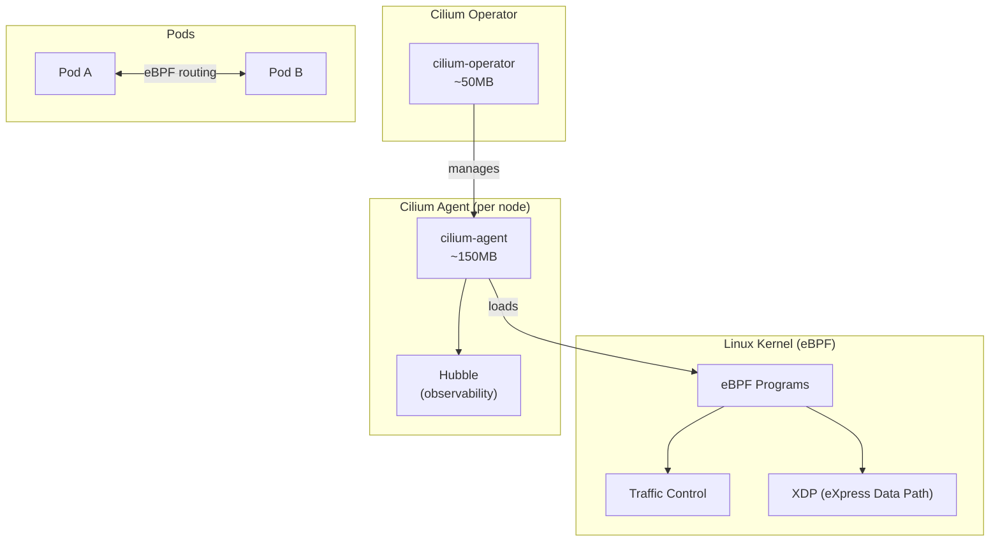

# ADR-025: CNI Selection - Cilium with eBPF

## Status
**Accepted**

## Date
2026-01-07

## Context

Talent Mesh requires a Container Network Interface (CNI) for Kubernetes networking. Options considered:

1. **Flannel**: K3s default, simple VXLAN overlay
2. **Calico**: Popular, iptables-based network policies
3. **Cilium**: eBPF-based, advanced observability

Key requirements:
- Network policies for service isolation
- Low latency for real-time WebRTC traffic
- Observability into network flows
- eBPF capabilities for modern kernel features

## Decision

We will use **Cilium** as the CNI with eBPF-based networking.

### Why Cilium Over Flannel/Calico

| Factor | Cilium | Flannel | Calico |
|--------|--------|---------|--------|
| **Architecture** | eBPF (kernel) | iptables/VXLAN | iptables |
| **Latency** | **0.20ms** | 0.40ms | 0.35ms |
| **Throughput** | **~9.2 Gbps** | ~6.5 Gbps | ~7 Gbps |
| **Memory per node** | ~150-300MB | ~50-100MB | ~100-200MB |
| **Network policies** | ✅ L3-L7 | ❌ None | ✅ L3-L4 |
| **Observability** | ✅ Hubble | ❌ None | ⚠️ Basic |
| **Service mesh** | ✅ Can replace sidecar | ❌ No | ❌ No |
| **kube-proxy replacement** | ✅ eBPF | ❌ No | ⚠️ Partial |

### Performance Benchmarks

```
Latency (P99):
┌────────────────────────────────────────────────────────┐
│ Flannel:  ████████████████████  0.40ms                │
│ Calico:   ██████████████████    0.35ms                │
│ Cilium:   ██████████            0.20ms (50% faster)   │
└────────────────────────────────────────────────────────┘

Throughput:
┌────────────────────────────────────────────────────────┐
│ Flannel:  ████████████████      6.5 Gbps              │
│ Calico:   ██████████████████    7.0 Gbps              │
│ Cilium:   ██████████████████████ 9.2 Gbps (41% faster)│
└────────────────────────────────────────────────────────┘
```

### Architecture



### K3s Installation with Cilium

```bash
# Install K3s without default CNI
curl -sfL https://get.k3s.io | sh -s - server \
  --cluster-init \
  --disable traefik \
  --disable servicelb \
  --disable local-storage \
  --flannel-backend=none \
  --disable-network-policy \
  --kube-controller-manager-arg="node-monitor-period=5s" \
  --kube-controller-manager-arg="node-monitor-grace-period=20s"

# Install Cilium via Helm
helm repo add cilium https://helm.cilium.io/
helm install cilium cilium/cilium \
  --namespace kube-system \
  --set kubeProxyReplacement=true \
  --set k8sServiceHost=${API_SERVER_IP} \
  --set k8sServicePort=6443 \
  --set hubble.enabled=true \
  --set hubble.relay.enabled=true \
  --set hubble.ui.enabled=true \
  --set operator.replicas=1 \
  --set resources.requests.memory=150Mi \
  --set resources.limits.memory=300Mi
```

### Cilium Helm Values

```yaml
# cilium-values.yaml
kubeProxyReplacement: true
k8sServiceHost: ${API_SERVER_IP}
k8sServicePort: 6443

# eBPF settings
bpf:
  masquerade: true
  clockProbe: true
  preallocateMaps: true
  tproxy: true

# Hubble observability
hubble:
  enabled: true
  metrics:
    enabled:
      - dns
      - drop
      - tcp
      - flow
      - icmp
      - http
    serviceMonitor:
      enabled: true
  relay:
    enabled: true
    resources:
      requests:
        memory: 64Mi
      limits:
        memory: 128Mi
  ui:
    enabled: true
    resources:
      requests:
        memory: 64Mi
      limits:
        memory: 128Mi

# Resource limits
resources:
  requests:
    cpu: 100m
    memory: 150Mi
  limits:
    cpu: 1000m
    memory: 300Mi

operator:
  replicas: 1
  resources:
    requests:
      memory: 64Mi
    limits:
      memory: 128Mi

# IP address management
ipam:
  mode: kubernetes

# Encryption (optional, Istio already provides mTLS)
encryption:
  enabled: false  # Using Istio mTLS instead
```

### Network Policies

Cilium supports L3-L7 network policies:

```yaml
# Allow only platform namespace to access databases
apiVersion: cilium.io/v2
kind: CiliumNetworkPolicy
metadata:
  name: database-access
  namespace: databases
spec:
  endpointSelector:
    matchLabels:
      app: postgres
  ingress:
  - fromEndpoints:
    - matchLabels:
        k8s:io.kubernetes.pod.namespace: platform
    toPorts:
    - ports:
      - port: "5432"
        protocol: TCP
---
# L7 HTTP policy example
apiVersion: cilium.io/v2
kind: CiliumNetworkPolicy
metadata:
  name: api-gateway-policy
  namespace: platform
spec:
  endpointSelector:
    matchLabels:
      app: api-gateway
  ingress:
  - fromEndpoints:
    - matchLabels:
        k8s:io.kubernetes.pod.namespace: istio-system
    toPorts:
    - ports:
      - port: "8080"
        protocol: TCP
      rules:
        http:
        - method: "GET"
          path: "/health"
        - method: "POST"
          path: "/api/.*"
```

### Hubble Observability

Hubble provides network flow visibility:

```bash
# View flows in real-time
hubble observe --namespace platform

# Filter by HTTP status
hubble observe --http-status 500

# View service map
hubble observe --to-service auth-service

# Export metrics to Prometheus
# Automatically scraped via ServiceMonitor
```

Hubble metrics exposed:
- `hubble_flows_processed_total`
- `hubble_drop_total`
- `hubble_tcp_flags_total`
- `hubble_dns_queries_total`
- `hubble_http_requests_total`

### Resource Requirements

| Component | Instances | Memory | CPU |
|-----------|-----------|--------|-----|
| cilium-agent | 3 (DaemonSet) | ~150MB each | 100m each |
| cilium-operator | 1 | ~64MB | 50m |
| hubble-relay | 1 | ~64MB | 50m |
| hubble-ui | 1 | ~64MB | 50m |
| **Total** | | **~640MB** | ~550m |

### Comparison with Istio

| Feature | Cilium | Istio Ambient |
|---------|--------|---------------|
| **L3-L4 policies** | ✅ eBPF | ✅ ztunnel |
| **L7 policies** | ✅ Envoy/eBPF | ✅ Waypoint |
| **mTLS** | ✅ WireGuard | ✅ SPIFFE |
| **Traffic management** | Basic | ✅ Full |
| **Service mesh** | Partial | ✅ Full |

**Our approach:** Use Cilium for CNI + network policies + observability, Istio Ambient for service mesh features (mTLS, traffic management, JWT validation).

## Consequences

### Positive

1. **Lower latency**: 50% faster than Flannel (critical for WebRTC)
2. **Higher throughput**: 41% better than Flannel
3. **eBPF efficiency**: Kernel-level packet processing
4. **Hubble observability**: Network flow visibility for free
5. **kube-proxy replacement**: Consistent hashing, no iptables randomness
6. **L7 policies**: HTTP-aware network policies

### Negative

1. **Higher memory**: ~640MB vs Flannel's ~150MB
2. **Kernel requirements**: Needs Linux 5.4+ (Contabo provides this)
3. **Complexity**: More configuration than Flannel

### Mitigations

- Disable unused features to reduce memory
- Use Grafana dashboards for Hubble metrics
- K3s + Cilium is a well-tested combination

## References

- [Cilium Documentation](https://docs.cilium.io/)
- [Cilium K3s Installation](https://docs.cilium.io/en/stable/installation/k3s/)
- [Hubble Observability](https://docs.cilium.io/en/stable/gettingstarted/hubble/)
- [Kubernetes CNI Benchmark 2025](https://sanj.dev/post/cilium-calico-flannel-cni-performance-comparison)
- [Cilium vs Flannel vs Calico](https://blog.devops.dev/stop-using-the-wrong-cni-flannel-vs-calico-vs-cilium-in-2025-c11b42ce05a3)

---

*ADR Version: 1.0*
*Last Updated: 2026-01-07*
