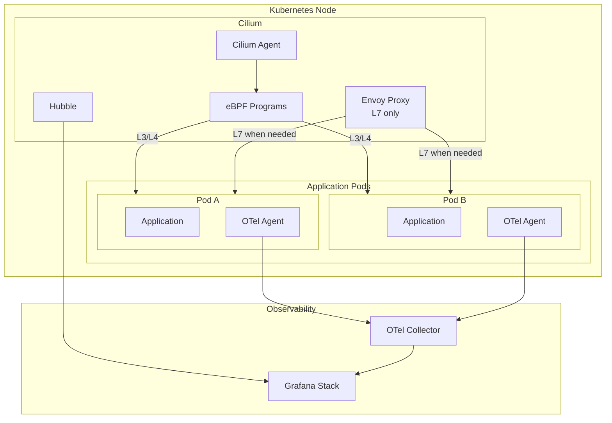

# ADR: Cilium Service Mesh

**Status:** Accepted
**Date:** 2026-01-17

## Context

OpenOva requires a service mesh for:
- mTLS encryption between services
- L7 traffic management and policies
- Observability (metrics, traces)
- Network policies

Previous decision used Istio with selectable modes (Ambient/Waypoint/Sidecar). After analysis, we determined that OpenTelemetry auto-instrumentation is independent of the service mesh, making Cilium Service Mesh a better choice.

## Decision

Use **Cilium Service Mesh** as the unified CNI + service mesh solution, replacing Istio entirely.

## Rationale

### Key Finding: OTel Independence

```
┌─────────────────────────────────────────────────────────────────┐
│                    OTel vs Service Mesh                          │
├─────────────────────────────────────────────────────────────────┤
│                                                                  │
│  OpenTelemetry auto-instrumentation:                            │
│    - Injected via init container                                │
│    - Java agent: javaagent.jar                                  │
│    - Python/Node: similar agents                                │
│    - SQL queries, HTTP calls, etc. captured by OTel             │
│    - INDEPENDENT of service mesh                                │
│                                                                  │
│  Service Mesh (Istio/Cilium):                                   │
│    - Handles mTLS encryption                                    │
│    - L7 traffic routing                                         │
│    - Network policies                                           │
│    - Does NOT provide SQL query visibility                      │
│                                                                  │
│  Conclusion: Cilium provides mesh features without              │
│              sacrificing observability (OTel handles it)        │
│                                                                  │
└─────────────────────────────────────────────────────────────────┘
```

### Comparison

| Feature | Istio | Cilium Service Mesh |
|---------|-------|---------------------|
| mTLS | Envoy/ztunnel | eBPF + WireGuard |
| L7 Policies | Envoy | CiliumEnvoyConfig |
| Network Policies | Via CNI | Native (eBPF) |
| Resource Overhead | Medium-High | Low |
| Observability | Envoy metrics | Hubble + OTel |
| CNI Integration | Separate | Unified |
| Complexity | High | Medium |

### Why Cilium Wins

1. **Unified Solution**: CNI + Service Mesh in one
2. **Lower Overhead**: eBPF-based, no sidecars required
3. **OTel Independence**: Application tracing works regardless
4. **Simpler Operations**: One component instead of two
5. **Hubble**: Native network observability

## Architecture



## Features

### mTLS (Mutual TLS)

Cilium provides transparent mTLS via:

```yaml
apiVersion: cilium.io/v2
kind: CiliumNetworkPolicy
metadata:
  name: require-mtls
spec:
  endpointSelector:
    matchLabels:
      app: my-service
  ingress:
    - fromEndpoints:
        - matchLabels:
            app: allowed-client
      authentication:
        mode: required
```

### L7 Policies

For HTTP/gRPC traffic management:

```yaml
apiVersion: cilium.io/v2
kind: CiliumNetworkPolicy
metadata:
  name: http-policy
spec:
  endpointSelector:
    matchLabels:
      app: api-service
  ingress:
    - fromEndpoints:
        - matchLabels:
            app: frontend
      toPorts:
        - ports:
            - port: "8080"
              protocol: TCP
          rules:
            http:
              - method: GET
                path: "/api/v1/.*"
              - method: POST
                path: "/api/v1/users"
```

### Traffic Management

Using Gateway API with Cilium:

```yaml
apiVersion: gateway.networking.k8s.io/v1
kind: HTTPRoute
metadata:
  name: app-route
spec:
  parentRefs:
    - name: cilium-gateway
  hostnames:
    - "app.example.com"
  rules:
    - matches:
        - path:
            type: PathPrefix
            value: /api
      backendRefs:
        - name: api-service
          port: 8080
      timeouts:
        request: 30s
      retry:
        attempts: 3
        backoff: 100ms
```

### Circuit Breaker

Via CiliumEnvoyConfig:

```yaml
apiVersion: cilium.io/v2
kind: CiliumEnvoyConfig
metadata:
  name: circuit-breaker
spec:
  services:
    - name: my-service
      namespace: default
  resources:
    - "@type": type.googleapis.com/envoy.config.cluster.v3.Cluster
      name: my-service
      circuit_breakers:
        thresholds:
          - max_connections: 100
            max_pending_requests: 100
            max_requests: 1000
            max_retries: 3
      outlier_detection:
        consecutive_5xx: 5
        interval: 30s
        base_ejection_time: 30s
```

## Configuration

### Cilium Helm Values

```yaml
# values.yaml
kubeProxyReplacement: true
k8sServiceHost: ${API_SERVER_IP}
k8sServicePort: 6443

# Service Mesh features
authentication:
  mutual:
    spire:
      enabled: false  # Using Cilium native

encryption:
  enabled: true
  type: wireguard

# L7 proxy
envoy:
  enabled: true

# Hubble observability
hubble:
  enabled: true
  relay:
    enabled: true
  ui:
    enabled: true
  metrics:
    enabled:
      - dns
      - drop
      - tcp
      - flow
      - icmp
      - http

# Gateway API
gatewayAPI:
  enabled: true
```

### OpenTelemetry Integration

OTel is configured independently:

```yaml
apiVersion: opentelemetry.io/v1alpha1
kind: Instrumentation
metadata:
  name: auto-instrumentation
  namespace: opentelemetry
spec:
  exporter:
    endpoint: http://collector.opentelemetry.svc:4317
  propagators:
    - tracecontext
    - baggage
  sampler:
    type: parentbased_traceidratio
    argument: "1.0"
  java:
    image: ghcr.io/open-telemetry/opentelemetry-operator/autoinstrumentation-java:latest
  python:
    image: ghcr.io/open-telemetry/opentelemetry-operator/autoinstrumentation-python:latest
  nodejs:
    image: ghcr.io/open-telemetry/opentelemetry-operator/autoinstrumentation-nodejs:latest
```

Pods opt-in via annotation:

```yaml
apiVersion: v1
kind: Pod
metadata:
  annotations:
    instrumentation.opentelemetry.io/inject-java: "true"
```

## Observability Stack

```
┌─────────────────────────────────────────────────────────────────┐
│                    Observability Architecture                    │
├─────────────────────────────────────────────────────────────────┤
│                                                                  │
│  Hubble (Cilium):                                               │
│    - Network flows                                              │
│    - DNS queries                                                │
│    - HTTP metrics (L7 policies)                                 │
│    - Dropped packets                                            │
│                                                                  │
│  OpenTelemetry:                                                 │
│    - Application traces                                         │
│    - SQL queries                                                │
│    - HTTP client calls                                          │
│    - Custom spans                                               │
│                                                                  │
│  Grafana Stack:                                                 │
│    - Loki: Logs                                                 │
│    - Mimir: Metrics (from Hubble + OTel)                       │
│    - Tempo: Traces (from OTel)                                 │
│    - Grafana: Dashboards                                        │
│                                                                  │
└─────────────────────────────────────────────────────────────────┘
```

## Migration from Istio

If migrating from Istio:

1. **Install Cilium** with service mesh features
2. **Remove Istio sidecars** (if using sidecar mode)
3. **Convert VirtualService** → HTTPRoute
4. **Convert DestinationRule** → CiliumNetworkPolicy + CiliumEnvoyConfig
5. **Verify OTel** continues working (it should, it's independent)

## Consequences

**Positive:**
- Unified CNI + service mesh
- Lower resource overhead (eBPF)
- OTel provides application observability independently
- Simpler operational model
- Native Kubernetes Gateway API support

**Negative:**
- Less mature than Istio for some features
- Fewer tutorials/examples available
- CiliumEnvoyConfig less intuitive than VirtualService

## Related

- [ADR-CNI-CILIUM-EBPF](./ADR-CNI-CILIUM-EBPF.md)
- [ADR-OBSERVABILITY-STACK](../../grafana/docs/ADR-OBSERVABILITY-STACK.md)
- [SPEC-CIRCUIT-BREAKER](../../handbook/docs/specs/SPEC-CIRCUIT-BREAKER.md)
