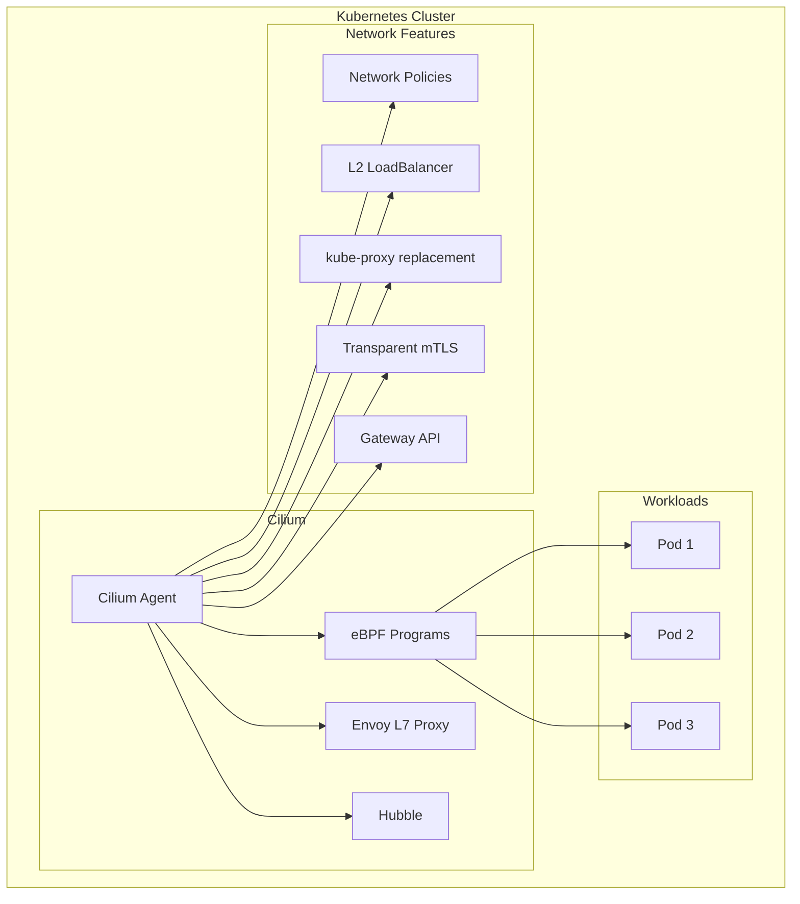
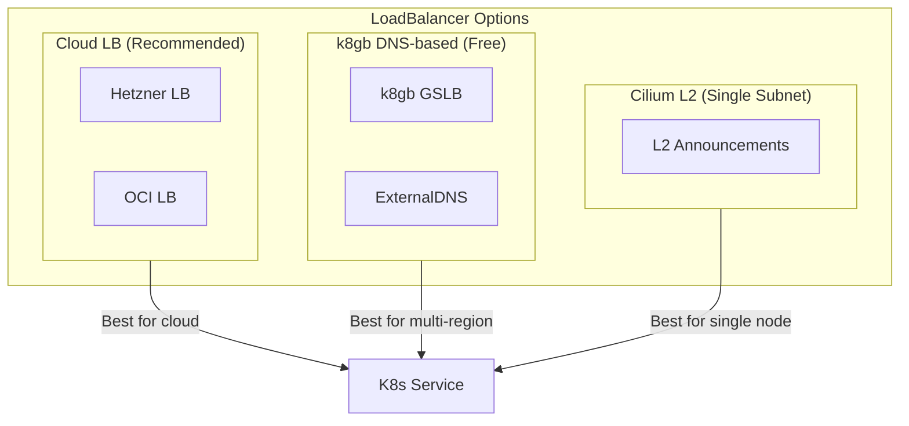

# ADR: Cilium CNI with eBPF

**Status:** Accepted
**Date:** 2024-03-01
**Updated:** 2026-01-17

## Context

Need a CNI for Kubernetes networking. K3s default (Flannel) lacks advanced features needed for multi-tenant, multi-region deployments.

## Decision

Use **Cilium** with eBPF as the CNI, replacing Flannel and kube-proxy. Cilium also provides **service mesh capabilities**, eliminating the need for a separate service mesh (Istio).

## Architecture



## Rationale

| Feature | Flannel | Cilium |
|---------|---------|--------|
| Basic networking | Yes | Yes |
| Network policies | No | Yes (L3-L7) |
| Observability | No | Yes (Hubble) |
| kube-proxy replacement | No | Yes |
| eBPF performance | No | Yes |
| Service mesh | No | Yes (built-in) |
| L2 LoadBalancer | No | Yes |
| Gateway API | No | Yes |

**Key Decision Factors:**
- Native L3-L7 network policies
- Hubble for network observability
- eBPF for better performance
- Replaces kube-proxy
- L2 LoadBalancer for bare-metal
- Built-in service mesh (no separate Istio needed)

## Configuration

```yaml
# Helm values
kubeProxyReplacement: true
k8sServiceHost: ${API_SERVER_IP}
k8sServicePort: 6443

# Hubble
hubble:
  enabled: true
  relay:
    enabled: true
  ui:
    enabled: true

# Gateway API
gatewayAPI:
  enabled: true

# Service Mesh
encryption:
  enabled: true
  type: wireguard  # or ipsec

# L7 proxy for advanced traffic management
envoy:
  enabled: true

# L2 LoadBalancer (optional)
l2announcements:
  enabled: true
```

## Features

| Feature | Purpose |
|---------|---------|
| kubeProxyReplacement | Replace kube-proxy with eBPF |
| hubble | Network observability |
| hubble.relay | Metrics export to Grafana |
| gatewayAPI | Gateway API for ingress |
| encryption | WireGuard-based mTLS |
| envoy | L7 traffic management |
| l2announcements | L2 LoadBalancer for bare-metal |

## Service Mesh Capabilities

Cilium provides full service mesh functionality:

| Capability | How Cilium Provides It |
|------------|------------------------|
| mTLS | WireGuard encryption (transparent) |
| L7 Policies | CiliumEnvoyConfig + Network Policies |
| Traffic Management | Gateway API (HTTPRoute, GRPCRoute) |
| Observability | Hubble metrics, flows, traces |
| Circuit Breaker | CiliumEnvoyConfig outlier detection |
| Retries | HTTPRoute retry policies |

See [ADR-CILIUM-SERVICE-MESH](./ADR-CILIUM-SERVICE-MESH.md) for full service mesh details.

## LoadBalancer Options



| Option | Cost | Multi-Region | Use Case |
|--------|------|--------------|----------|
| Cloud LB | Paid | Via k8gb | Production |
| k8gb DNS-based | Free | Native | Cost-sensitive |
| Cilium L2 | Free | No | Single subnet/dev |

## Gateway API Integration

Cilium replaces traditional ingress controllers with Gateway API:

```yaml
apiVersion: gateway.networking.k8s.io/v1
kind: Gateway
metadata:
  name: cilium-gateway
spec:
  gatewayClassName: cilium
  listeners:
    - name: https
      port: 443
      protocol: HTTPS
      tls:
        mode: Terminate
        certificateRefs:
          - name: tls-secret
---
apiVersion: gateway.networking.k8s.io/v1
kind: HTTPRoute
metadata:
  name: app-route
spec:
  parentRefs:
    - name: cilium-gateway
  hostnames:
    - "app.example.com"
  rules:
    - matches:
        - path:
            type: PathPrefix
            value: /
      backendRefs:
        - name: app-service
          port: 80
```

## Consequences

**Positive:**
- Advanced network policies (L3-L7)
- Network observability via Hubble
- eBPF performance
- kube-proxy replacement
- L2 LoadBalancer option
- Built-in service mesh (no separate mesh needed)
- Unified networking and mesh

**Negative:**
- More complex than Flannel
- eBPF kernel requirements (5.10+)

## Related

- [ADR-CILIUM-SERVICE-MESH](./ADR-CILIUM-SERVICE-MESH.md)
- [ADR-K8GB-GSLB](../../k8gb/docs/ADR-K8GB-GSLB.md)
- [SPEC-PLATFORM-TECH-STACK](../../handbook/docs/specs/SPEC-PLATFORM-TECH-STACK.md)
