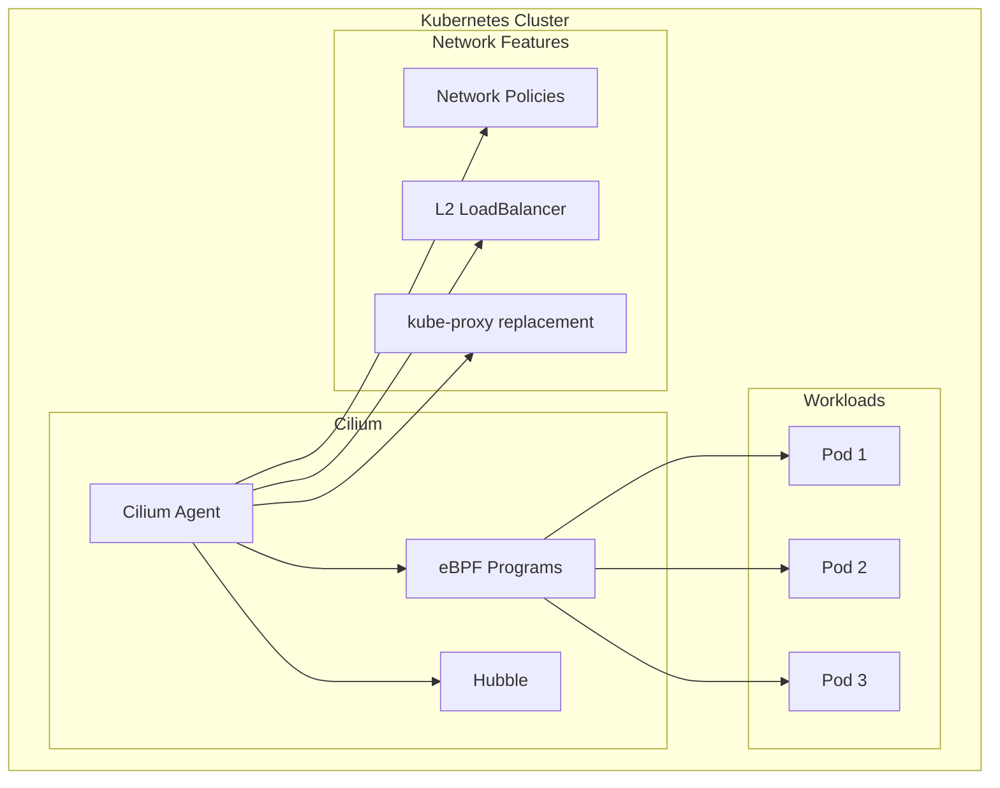
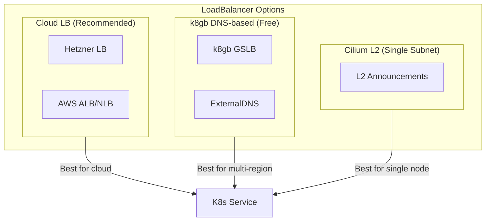
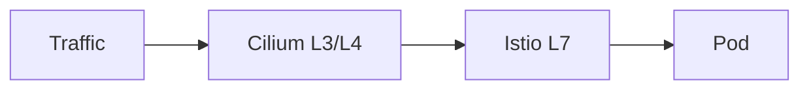

# ADR: Cilium CNI with eBPF

**Status:** Accepted
**Date:** 2024-03-01
**Updated:** 2026-01-16

## Context

Need a CNI for Kubernetes networking. K3s default (Flannel) lacks advanced features needed for multi-tenant, multi-region deployments.

## Decision

Use **Cilium** with eBPF as the CNI, replacing Flannel and kube-proxy.

## Architecture



## Rationale

| Feature | Flannel | Cilium |
|---------|---------|--------|
| Basic networking | Yes | Yes |
| Network policies | No | Yes (L3-L7) |
| Observability | No | Yes (Hubble) |
| kube-proxy replacement | No | Yes |
| eBPF performance | No | Yes |
| Service mesh integration | No | Yes |
| L2 LoadBalancer | No | Yes |

**Key Decision Factors:**
- Native L3-L7 network policies
- Hubble for network observability
- eBPF for better performance
- Replaces kube-proxy
- L2 LoadBalancer for bare-metal

## Configuration

```yaml
# Helm values
kubeProxyReplacement: true
k8sServiceHost: ${API_SERVER_IP}
k8sServicePort: 6443

# Hubble
hubble:
  enabled: true
  relay:
    enabled: true
  ui:
    enabled: true

# L2 LoadBalancer (optional)
l2announcements:
  enabled: true
```

## Features

| Feature | Purpose |
|---------|---------|
| kubeProxyReplacement | Replace kube-proxy with eBPF |
| hubble | Network observability |
| hubble.relay | Metrics export to Grafana |
| l2announcements | L2 LoadBalancer for bare-metal |

## LoadBalancer Options



| Option | Cost | Multi-Region | Use Case |
|--------|------|--------------|----------|
| Cloud LB | Paid | Via k8gb | Production |
| k8gb DNS-based | Free | Native | Cost-sensitive |
| Cilium L2 | Free | No | Single subnet/dev |

## Istio Integration

Cilium and Istio work together:
- Cilium: L3/L4 network policies, kube-proxy replacement
- Istio: L7 service mesh, mTLS, traffic management



## Consequences

**Positive:**
- Advanced network policies (L3-L7)
- Network observability via Hubble
- eBPF performance
- kube-proxy replacement
- L2 LoadBalancer option

**Negative:**
- More complex than Flannel
- eBPF kernel requirements (5.10+)

## Related

- [ADR-ISTIO-SERVICE-MESH](../../istio/docs/ADR-ISTIO-SERVICE-MESH.md)
- [ADR-K8GB-GSLB](../../k8gb/docs/ADR-K8GB-GSLB.md)
